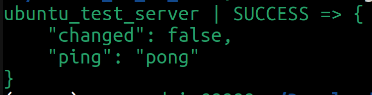
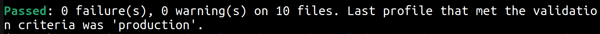

# Ubuntu 24.04 LTS Setup with Ansible

## Overview
This project automates the setup of an Ubuntu 24.04 LTS system using Ansible. It includes tasks such as installing apt packages, creating directories, configuring user environments, and more. The playbook calls the `main.yml` file, and then calls multiple tasks in the `./tasks` directory.

## Requirements
- git
- python3
- pip3
- vim

## Prerequisites
This document assumes you already have SSH keys installed and configured for your (localhost server and remote client machine). You should also have an isolated python environment installed and activated with the `requirements.txt` `pip` packages installed. **Additionally, this document assumes you have a user named `superadmin` on your localhost machine. If your username is different, please adjust the files under the `./tasks` directory accordingly.**


## Requirements.txt file contents

The `requirements.txt` file for this project includes the `ansible-dev-tools` package. This convenient package bundles a suite of essential tools for Ansible development, streamlining the setup process and providing a comprehensive environment for working with Ansible.

The `ansible-dev-tools` package includes the following tools:

*   **ansible-builder:** Automates the creation of execution environments for Ansible Collections.
*   **ansible-core:** The core Ansible automation engine, enabling infrastructure automation and management.
*   **ansible-creator:** A tool for quickly generating Ansible content (collections, roles, etc.).
*   **ansible-dev-environment:** Simplifies the installation of Ansible Collections and their dependencies.
*   **ansible-lint:** Checks Ansible playbooks for best practices and potential improvements.
*   **ansible-navigator:** Provides a text-based user interface (TUI) for interacting with Ansible.
*   **ansible-sign:** Enables signing and verification of Ansible project directories for security.
*   **molecule:** A framework for developing and testing Ansible content (collections, playbooks, and roles).
*   **pytest-ansible:** A pytest plugin that allows using Ansible within tests, enabling pytest as a collection unit test runner, and exposing molecule scenarios.
*   **tox-ansible:** A tox plugin that creates a matrix of Python and Ansible versions for integration, sanity, and unit testing of Ansible collections.

With including `ansible-dev-tools` in `requirements.txt`, this project ensures that all necessary tools for ansible development are readily available after installing the project dependencies.

## Installation

1. **Install the required apt packages:**

    ```bash
    sudo apt update && sudo apt install git python3 python3-dev python3-venv vim -y
    ```

2. **Clone the repository:**

    ```bash
    git clone https://github.com/LinuxSystemsEngineer/ubuntu_2404_ansible_dev_env.git
    ```

3. **Change directories to the newly cloned github repository:**

    ```bash
    cd ubuntu_2404_ansible_dev_env
    ```

4. **Create an isolated python virtual environment:**

    ```bash
    python3 -m venv .venv
    ```

5. **Activate the newly created python virtual environment:**

    ```bash
    . .venv/bin/activate
    ```

6. **Install required pip packages from the `requirements.txt` file:**

    ```bash
    pip3 install -r requirements.txt
    ```

## Configuring the ./hosts file

The `./hosts` file is crucial for ansible to connect to your target servers.  Before running the playbook, you *must* configure this file to reflect the IP address of your remote client machine.

1.  **Locate the hosts file:** The `hosts` file is located in the main directory of your ansible project.

2.  **Edit the hosts file:** Open the `./hosts` file using a text editor (e.g., `vim`, `nano`, or visual studio code).

    ```bash
    vim ./hosts
    ```

3.  **Add or modify the server entry:**  You'll see a section like this (or similar):

    ```ini
    [staging_servers]
    ubuntu_test_server ansible_host=192.168.1.11
    ```
  
  
    *   **`ansible_host=192.168.1.11`:**  *This is the most important part.* Replace `192.168.1.11` with the *actual IP address* of your remote client machine.

4.  **Save the changes:** Save the `hosts` file after making the necessary changes.

5.  **Test your changes and ensure the ansible ping test works:**  Run this command:

    ```bash
    ansible staging_servers -m ping
    ```
8.  **Verify the ping test worked correctly:**  You'll see terminal output like this (or similar):

    ```ini
    ubuntu_test_server | SUCCESS => {
    "changed": false,
    "ping": "pong"
    }
    ```
  

**./hosts config file example:**

Let's say your remote client machine's IP address is `10.0.0.20`. Your `./hosts` file should look like this:

```ini
[staging_servers]
ubuntu_test_server ansible_host=10.0.0.20
```

## Ansible linting and idempotency

This project emphasizes code quality, maintainability, and predictable execution through the use of `ansible-lint` and adherence to idempotent principles.

`ansible-lint` is a powerful tool that analyzes your ansible playbooks and roles, checking for best practices, common errors, and potential improvements. It helps ensure that your Ansible code is consistent, reliable, and easy to understand.

**Idempotency in ansible:**

A key concept in ansible is *idempotency*.  An operation is idempotent if it can be performed multiple times without changing the result beyond its initial application.  In simpler terms, if you run an ansible playbook multiple times, it should have the same effect as running it once.  This is crucial for ensuring consistent and stable infrastructure management.

For example, if a task installs a package, running the playbook again should *not* reinstall the package.  Ansible will detect that the package is already installed and skip the task.  This prevents unintended changes and makes your playbooks safe to run repeatedly.

Idempotency makes Ansible playbooks:

*   **Safe to run multiple times:** You can run a playbook without fear of causing unintended side effects. This is essential for managing complex infrastructure and ensuring consistency.
*   **Sameness:**  You can rely on your playbooks to produce the same outcome regardless of how many times they are run.
*   **Robust:**  Idempotency makes your infrastructure management more robust and resilient to errors.

This playbook is designed with idempotency in mind.  Tasks are written to check the current state of the system before making changes, ensuring that they only perform actions when necessary.

**Prerequisites for using ansible-lint:**

Before you can use `ansible-lint`, ensure the following prerequisites are met:

1.  **Python virtual environment:** A python virtual environment must be created and activated. This isolates the project's dependencies and prevents conflicts with system wide packages. Instructions for creating and activating a virtual environment are provided in the Installation section of this README.

2.  **Install requirements:** The `requirements.txt` file, containing the necessary python packages (including `ansible-dev-tools`), must be installed using `pip`. This ensures that `ansible-lint` and its dependencies are available within the active virtual environment. The installation steps are detailed in the Installation section.

**How to run ansible lint:**

After meeting the prerequisites, you can run the linter against your playbooks. From the main directory of your ansible project (where your `main.yml` file is located), execute the following command:


1. **Run ansible lint:**

    ```bash
    ansible-lint main.yml
    ```


## Usage

1. **Run the ansible playbook:**

    ```bash
    ansible-playbook main.yml -K
    ```

    You will be prompted for your sudo password.


## Playbook structure
- `main.yml`: The main playbook that sets up the server.
- `./tasks`: Directory containing task files.

## Features

- Install essential apt packages (see list below)
- Create development directory structure (see explanation below)
- Create and configure sudo user file
- Customize `.bashrc` with terminal colors, environment variable paths (including `$DEV`), and increased CLI history size. These customizations are applied to the local user, root user, and the `/etc/skel` directory.
- Customize `.vimrc` with color schemes. These customizations are applied to the local user, root user, and the `/etc/skel` directory.

**Important note about user environment customization:** This playbook configures `.bashrc` and `.vimrc` files for the local user, root user, and also within the `/etc/skel` directory. `/etc/skel` is a special directory that contains template files for new user accounts. With placing customized `.bashrc` and `.vimrc` files in `/etc/skel`, *any new user created on the system after the playbook runs will automatically inherit these customizations*. This ensures a consistent and personalized environment for all users, including custom pathing, vim colors, and increased history size.

## Development directory structure and environment variable

This playbook creates a structured development directory at `~/devops`. This organized structure provides a reserved space for various projects and tools, making it easier to manage and navigate your development work.  The following subdirectories are created:

* `ansible`: For ansible playbooks and related files.
* `databases`: For database related projects and scripts, with subdirectories for different database systems (MySQL, SQLite, PostgreSQL, MongoDB, Redis).
* `docker`: For docker related projects and configuration.
* `documentation`: For project documentation, including a `resume` subdirectory.
* `git`: For git repositories.
* `kubernetes`: For kubernetes related files.
* `libvirt`: For libvirt virtualization.
* `podman`: For podman containerization.
* `programming`: For programming projects, with subdirectories for various languages (Bash, C, Go, Java, Python).
* `webdev`: For web development projects, with subdirectories for frameworks and resources (Django, W3Schools, and a `www` directory for web projects).

To quickly access this main development directory, the playbook also sets the environment variable `$DEV` to `~/devops`.  This allows you to simply type `cd $DEV` in your terminal to navigate directly to your development workspace, saving time and effort.

## Installed packages and their purposes

The following packages are installed by the playbook to provide a well-rounded development and system administration environment:

* **Development tools:** `build-essential`, `git`, `golang-go`, `golang-src`
* **System utilities:** `bzip2`, `curl`, `dnsutils`, `dstat`, `etckeeper`, `info`, `locate`, `lshw`, `lsof`, `mtr`, `net-tools`, `nethogs`, `nload`, `nmap`, `plocate`, `screen`, `sysstat`, `systemd-timesyncd`, `tcpdump`, `tmux`, `traceroute`, `tree`, `ufw`, `unzip`, `vim`, `wget`, `whois`, `xz-utils`, `zip`
* **Multimedia:** `ffmpeg`, `imagemagick`
* **Monitoring:** `htop`, `iftop`, `iotop`, `iptables`, `iptraf-ng`, `iputils-tracepath`
* **Networking:** `openssh-client`
* **Document conversion:** `pandoc`
* **Python development:** `python3`, `python3-dev`, `python3-venv`

This selection of packages is designed to provide a comprehensive toolkit for various tasks, ranging from software development, system administration, network engineering, and performance monitoring.

## Programmer
 **Blake Jones** built this project. For any questions or further information, please contact me on LinkedIn.

* https://www.linkedin.com/in/blake-jones-linux

## Contributions
Feel free to fork this project and submit pull requests. For significant changes, please open an issue first to discuss what you would like to change.

## Screenshots

- **Ansible ping test results:**


- **Ansible lint results:**

